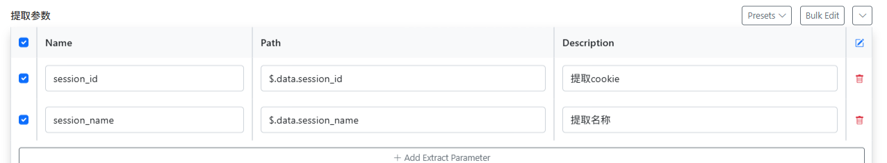
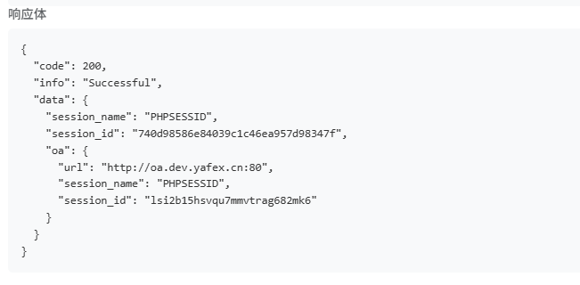
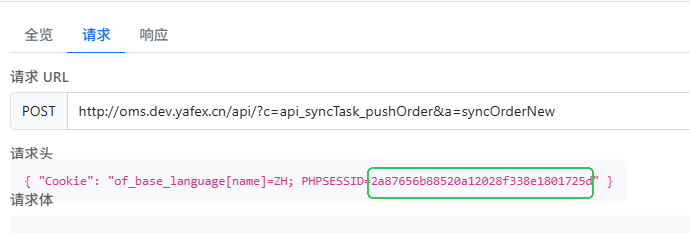

## EasyTesting操作手册

#### 1. 参数提取
 测试用例中，如果请求返回了参数，那么可以在用例中提取参数，并保存到环境变量中，方便后续请求使用。
 * *参数提取* : 使用 "$.提取参数路径" 表示提取参数, 例如：
    ```
    $.data.session_id
    ```
   
   
   

#### 2. 使用参数
 在用例中，可以使用参数提取后的参数，用于上下游接口传递 参数。
 * *使用参数* : 使用 "$提取参数名" 表示使用参数, 例如：
    ```
    of_base_language[name]=ZH; PHPSESSID=$session_id
    ```
    
    